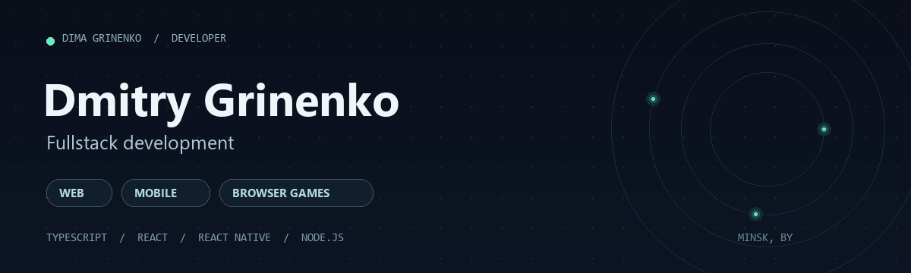
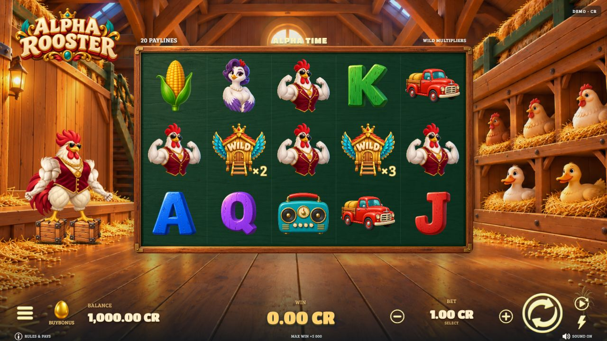
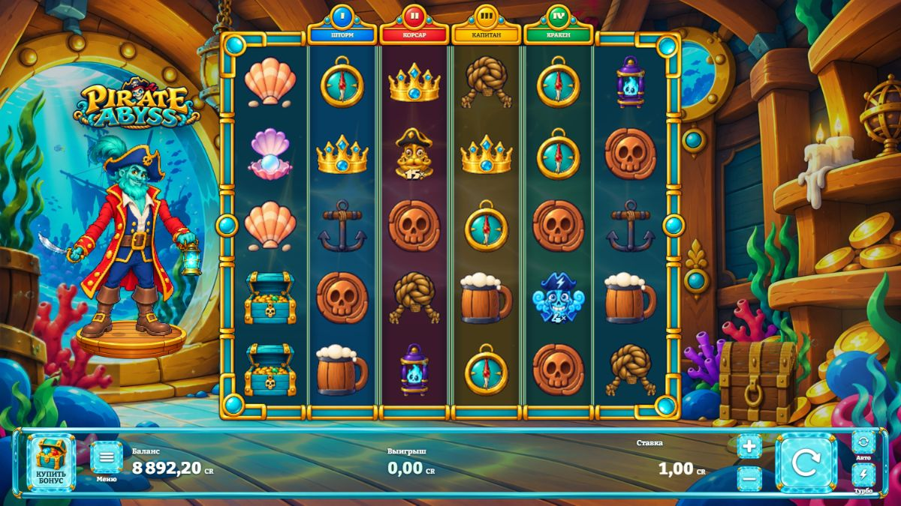
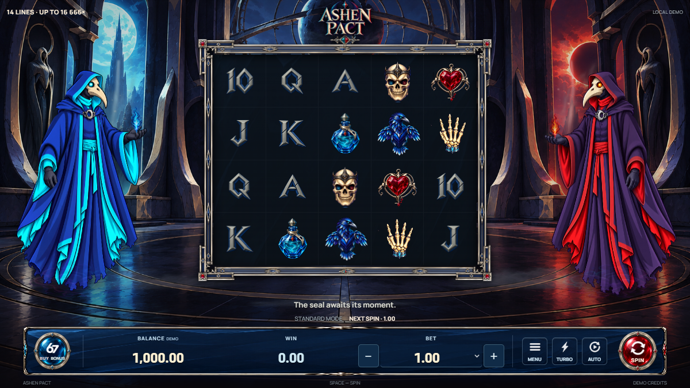

  

  <a href="#game-development">Game development</a> &nbsp;·&nbsp;
  <a href="#web--mobile">Web & mobile</a> &nbsp;·&nbsp;
  <a href="#technical-toolkit">Technical toolkit</a> &nbsp;·&nbsp;
  <a href="#experience">Experience</a>

## About me

I'm **Dmitry Grinenko**, a fullstack developer based in Minsk, Belarus. I build web applications, React Native mobile apps and animated browser games with JavaScript and TypeScript.

My commercial experience covers frontend and backend development, application maintenance, bug fixes and test data preparation. I have also worked on casino-related projects. My current game work focuses on personal slot prototypes, their interfaces, animation and game presentation.

**Open to remote full-time, part-time and project work** in web development, mobile development and iGaming.

## Game development

Three distinct visual worlds, built as browser-based game projects. Screenshots below show the actual game interfaces. These are development showcases, not claims of platform approval or commercial launch.

<table>
  <tr>
    <td width="33%" valign="top">
      
      <h3><a href="https://github.com/DimaGrinenko/alpha-rooster">Alpha Rooster</a></h3>
      
A cartoon barn, animated characters, 20 paylines and four bonus features.

      
<code>React</code> <code>TypeScript</code> <code>Vite</code> <code>Spine</code>

    </td>
    <td width="33%" valign="top">
      
      <h3><a href="https://github.com/DimaGrinenko/pirate-abyss">Pirate Abyss</a></h3>
      
A pirate-themed game with animated presentation, character rigs and responsive controls.

      
<code>React</code> <code>PixiJS</code> <code>Spine</code> <code>GSAP</code>

    </td>
    <td width="33%" valign="top">
      
      <h3><a href="https://github.com/DimaGrinenko/ashen-pact">Ashen Pact</a></h3>
      
A dark-fantasy game with two raven characters, Spine animation and a local demo engine.

      
<code>React</code> <code>TypeScript</code> <code>Vite</code> <code>Spine</code>

    </td>
  </tr>
</table>

## Web & mobile

### [IRON MIND AI](https://github.com/DimaGrinenko/irond_mind_ai)
**Fitness application with a mobile client and a NestJS API.**

Workout and set logging, training programs, nutrition tracking and progress statistics. The mobile app includes local SQLite storage; the API includes authentication and trainer/admin roles.

`React Native` `Expo` `TypeScript` `Zustand` `SQLite` `NestJS` `Prisma`

### [Field Tasks](https://github.com/DimaGrinenko/react-native-test-task)
**Task management for mobile workflows.**

Task creation and editing, search, sorting, attachments, history, maps and local notifications. Local persistence and a REST synchronization prototype support offline workflows.

`React Native` `Expo` `TypeScript` `Zustand` `AsyncStorage` `json-server`

### [BoostLink](https://github.com/DimaGrinenko/-BoostLink-App)
**Rewards-platform prototype with a mobile UI and a separate backend API.**

Quest, wallet and marketplace screens currently use mock data. The backend includes authentication, quest review, wallet operations, marketplace workflows and payment integration handlers.

`React Native` `Expo` `NestJS` `PostgreSQL` `Prisma` `Redis` `BullMQ` `Socket.IO`

<strong>More web and backend projects</strong>

- [Aroma House](https://github.com/DimaGrinenko/shop-catalog): a responsive HTML/CSS coffee catalog and landing page.
- [NestJS projects](https://github.com/DimaGrinenko/nestjs-projects): a book-catalog API using NestJS, TypeORM, PostgreSQL and Swagger.
- [AI Assistant](https://github.com/DimaGrinenko/Ai-assistant-app): a mobile assistant prototype with chat sessions, tasks and a NestJS API.

## Technical toolkit

- **Languages:** JavaScript, TypeScript, SQL.
- **Frontend:** React, Vue.js, HTML, CSS.
- **Mobile:** React Native, Expo, Zustand, AsyncStorage, SQLite.
- **Backend:** Node.js, NestJS, Express, Prisma.
- **Data:** PostgreSQL, Microsoft SQL Server, Redis.
- **Game presentation:** PixiJS, Spine, GSAP.
- **Workflow:** Git, Docker, Linux, CI/CD, Vite.

## Experience

**Fullstack Developer · Baldmonkey LTD** 
February 2024 to December 2025

Developed and maintained the client and server sides of a web application, fixed bugs and prepared test data.

**Education:** Information Systems and Technologies, MITSO International University. Expected graduation: 2027.

**Languages:** Belarusian (native), Russian (C2), English (B1).

Web applications · Mobile products · Animated browser games

